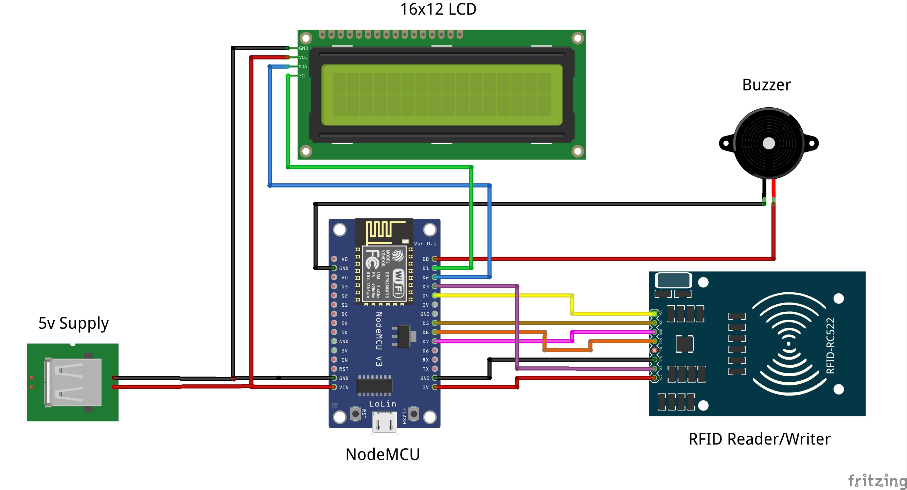
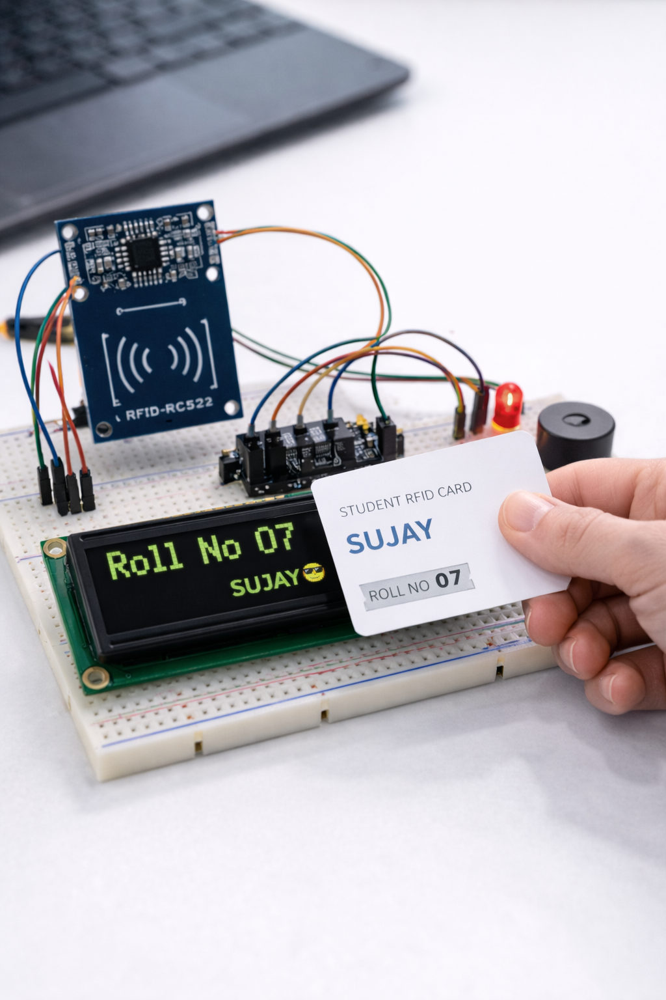
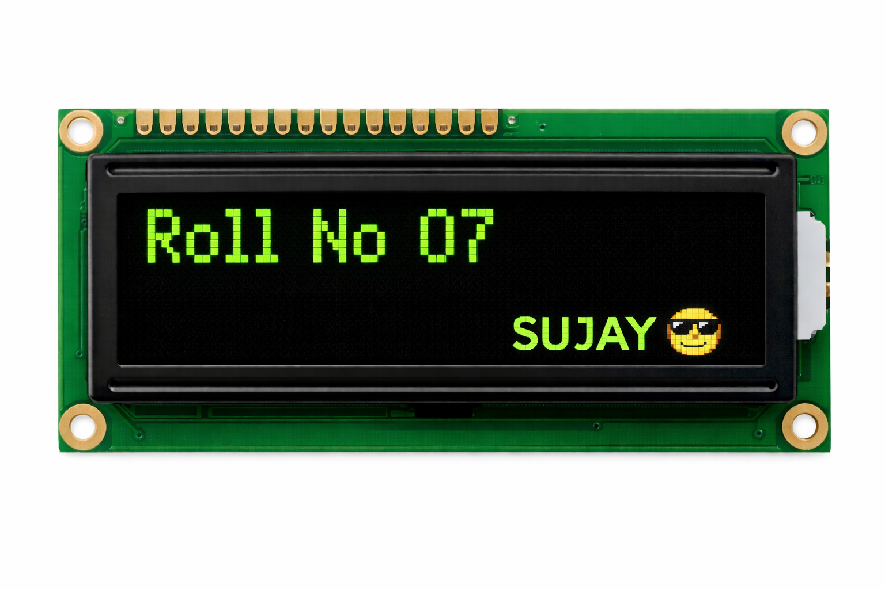
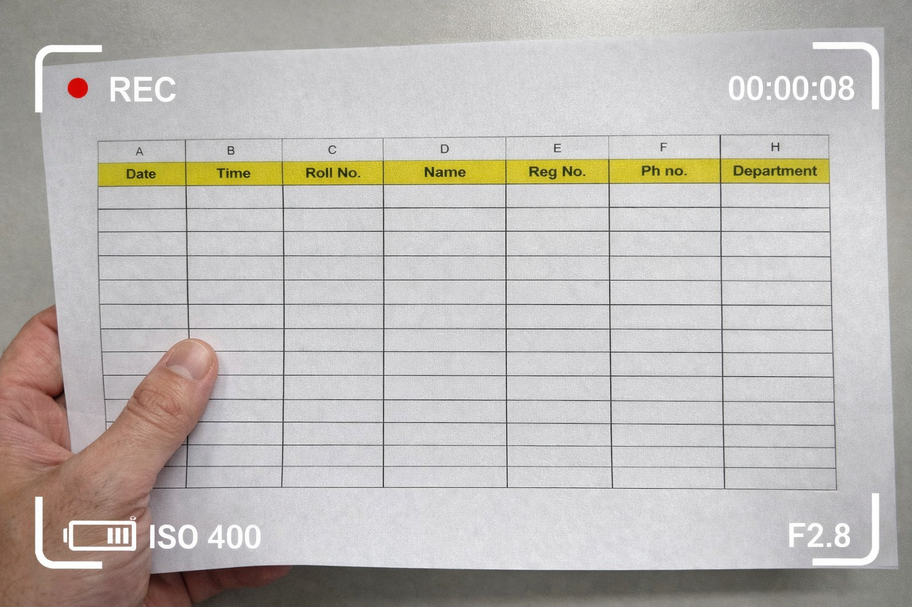

🌐 IoT Based RFID Student Attendance System using ESP8266, LCD & Google Sheets

"Project" (https://img.shields.io/badge/Project-RFID%20Attendance-blue)
"Branch" (https://img.shields.io/badge/Branch-Electrical%20Engineering-yellow)
"Platform" (https://img.shields.io/badge/Platform-NodeMCU%20ESP8266-green)
"Database" (https://img.shields.io/badge/Database-Google%20Sheets-orange)
"Display" (https://img.shields.io/badge/Display-LCD%2016x2-lightgrey)
"Alert" (https://img.shields.io/badge/Alert-Buzzer-red)
"Status" (https://img.shields.io/badge/Status-Completed-brightgreen)

---

🧑‍💻 Developer

SUJAY 😎

🎓 Electrical Engineering Student
⚡ IoT & Embedded Systems Enthusiast
📟 RFID System Developer

🔗 GitHub:
https://github.com/sujay5372bot

---

📖 Abstract

The IoT-Based RFID Student Attendance System is designed to automate attendance recording using RFID technology and NodeMCU ESP8266 WiFi module.

In this system, each student carries an RFID card. When the card is scanned, the RFID reader reads the UID and sends it to the NodeMCU. The student name is displayed on the LCD, and the buzzer gives an alert sound. The attendance data is then transmitted through WiFi and stored in Google Sheets using Google Apps Script.

This project demonstrates the real-world implementation of IoT-based automation in modern Electrical Engineering systems.

---

🎯 Objectives

- Automate attendance recording
- Reduce manual errors
- Display student name on LCD
- Provide buzzer confirmation
- Store attendance in Google Sheets
- Enable real-time cloud storage
- Demonstrate IoT-based communication

---

🧠 System Architecture

RFID Tag
     ↓
RFID Reader (RC522)
     ↓
NodeMCU ESP8266
     ↓
LCD Display + Buzzer
     ↓
WiFi Network
     ↓
Google Apps Script
     ↓
Google Sheets Database

---

🔌 Circuit Diagram

Save the generated circuit diagram inside:

Images/nodemcu_rc522_circuit.png

Then display using:

## 🔌 Circuit Diagram

---

🔌 Hardware Connections

📟 RC522 to NodeMCU

RC522 Pin| NodeMCU Pin
SDA| D4
SCK| D5
MOSI| D7
MISO| D6
RST| D3
GND| GND
3.3V| 3.3V

---

📺 LCD (I2C) Connections

LCD Pin| NodeMCU Pin
VCC| 3.3V
GND| GND
SDA| D2
SCL| D1

---

🔔 Buzzer Connection

Buzzer| NodeMCU
Positive| D0
Negative| GND

---

🛠️ Hardware Components

- NodeMCU ESP8266
- RFID Reader RC522
- RFID Cards / Tags
- LCD Display (16x2 I2C)
- Buzzer
- Breadboard
- Jumper Wires
- Power Supply
- WiFi Network

---

💻 Software Requirements

- Arduino IDE
- ESP8266 Board Package
- MFRC522 Library
- SPI Library
- LiquidCrystal_I2C Library
- Google Sheets
- Google Apps Script

---

🌐 Google Sheets Integration

Attendance data is stored directly into Google Sheets using Google Apps Script Web API.

Data Flow

RFID Scan
     ↓
UID Detected
     ↓
Student Name Matched
     ↓
LCD Displays Name
     ↓
Buzzer Beeps
     ↓
HTTP Request Sent
     ↓
Google Sheets Updated

---

📊 Example Stored Data

Name| UID| Date| Time
Rahul| A7F23B| 2026-04-18| 10:25 AM

---

⚙️ Working Principle

1️⃣ Student scans RFID card
2️⃣ RC522 reads UID
3️⃣ NodeMCU processes UID
4️⃣ Student name displayed on LCD
5️⃣ Buzzer gives alert sound
6️⃣ ESP8266 connects to WiFi
7️⃣ HTTP request sent
8️⃣ Data stored in Google Sheets

---

🌐 IoT Features

✅ Real-Time Attendance
✅ Cloud-Based Storage
✅ Wireless Communication
✅ LCD Display Output
✅ Buzzer Alert System
✅ Automatic UID Detection

---

📷 Project Images

(Add your real project photos)

## 📟 Hardware Setup

## 📶 RFID Scan

## 📺 LCD Display Output

## 🌐 Google Sheets Output

---

📊 Advantages

- Fast attendance recording
- Real-time cloud storage
- Wireless operation
- Audio confirmation
- Visual display output
- Easy data management

---

⚠️ Limitations

- Requires stable WiFi
- Limited RFID reading range
- Requires RFID cards

---

🔮 Future Scope

- Mobile App Integration
- Web Dashboard
- SMS Notifications
- Email Alerts
- Face Recognition
- Biometric Authentication

---

🧪 Testing & Results

The system was tested using multiple RFID cards. Each scan successfully displayed the student name on LCD, activated buzzer alert, and recorded attendance in Google Sheets.

The system showed stable performance during continuous testing.

---

📚 Applications

- Schools
- Colleges
- Offices
- Smart Classrooms
- Industrial Attendance Systems

---

📜 Conclusion

The IoT-Based RFID Attendance System using ESP8266, LCD, and Google Sheets provides an efficient, automated, and reliable attendance solution.

This project demonstrates the integration of RFID technology, IoT communication, and cloud-based storage in modern Electrical Engineering applications.

---

📖 References

- Arduino Official Documentation
- ESP8266 Documentation
- Google Apps Script Documentation
- RFID RC522 Datasheet

https://www.arduino.cc
https://developers.google.com/apps-script

---

🙌 Acknowledgement

I sincerely thank my teachers and mentors for their valuable guidance and support throughout this project development.

---

⭐ Support

If you like this project:

⭐ Star the repository
🍴 Fork the repository
📢 Share with others

---

🏷️ Keywords

RFID, NodeMCU, ESP8266, IoT, Google Sheets, LCD, Buzzer, Attendance System, Electrical Engineering Project
